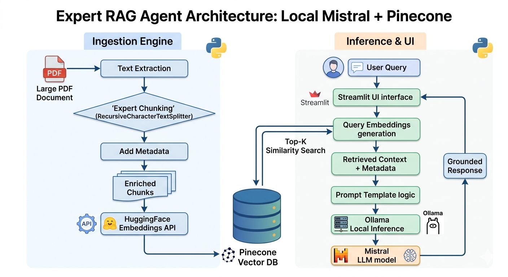
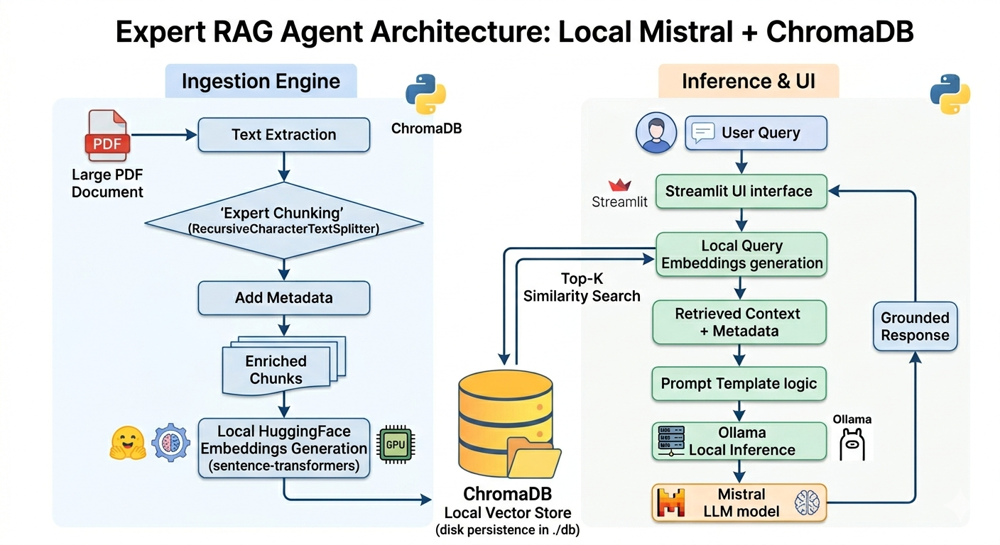

# 🧠 Expert RAG Agent: 100% Local Mistral + ChromaDB

A production-grade Retrieval-Augmented Generation (RAG) implementation designed for **maximum privacy**. This project demonstrates advanced document processing, context-aware chunking, and grounded AI responses without any data leaving the host machine.

This showroom highlights the ability to build enterprise-ready AI solutions for sensitive sectors (Legal, Health, Finance) using a fully local stack: **Ollama (Mistral)** for inference and **ChromaDB** for on-device vector storage.

## 🏗️ Architecture

The system is decoupled into an ingestion engine and a retrieval chain, ensuring scalability and clean code standards.

🛡️ Privacy Architecture (Zero Data Leakage)
This agent is engineered for total data sovereignty. By combining Ollama's local LLM orchestration with ChromaDB's on-device persistent storage, no sensitive information is ever transmitted to external APIs or cloud providers. All embeddings are generated locally using sentence-transformers.

✨ Key Features (The "Expert" Edge)
Context-Aware Semantic Chunking: Uses a recursive splitting strategy with specific delimiters to maintain the logical flow of technical documents.

On-Device Vector Persistence: Demonstrates expertise in managing local databases (./db) without relying on SaaS providers like Pinecone.

RAG X-Ray Dashboard: A dedicated inspection tab that visualizes the "thinking process" — showing retrieved chunks, metadata, and similarity ranking.

Source Provenance: Automatic citation of sources (document name and page number) to eliminate hallucinations.

🚀 Getting Started
1. Local LLM Setup

python3 -m venv venv_rag

source venv_rag/bin/activate

pip3 install --upgrade pip

pip3 install -r requirements.txt

ollama run mistral

streamlit run app.py

Install Ollama and download the model:	curl -fsSL https://ollama.com/install.sh | sh
										ollama run mistral

2. Environment Setup

git clone [https://github.com/AndreFCosta608/expert-rag-agent.git](https://github.com/AndreFCosta608/expert-rag-agent.git)
cd expert-rag-agent
python -m venv venv
source venv/bin/activate  # Windows: venv\Scripts\activate
pip3 install -r requirements.txt

3. Run the Dashboard

streamlit run app.py

📂 Project Structure

expert-rag-agent/
├── app.py                 # Streamlit UI & Dashboard Logic
├── engine/                # Core AI Engine
│   ├── ingestion.py       # PDF parsing & ChromaDB management
│   └── rag_chain.py       # Langchain, Ollama & Prompt engineering
├── db/                    # Local Vector Storage (Created on first run)
├── requirements.txt       # Local-first dependencies
└── .env		           # Configuration template

🧪 Evaluation
To test the "Expert" capabilities, upload a dense technical document (e.g., a 100+ page manual or financial report). Use the RAG X-Ray tab to verify how the recursive chunking strategy preserved the context of complex tables or long paragraphs.

🧪Places to get large free PDF files...

https://www.ipcc.ch/report/the-regional-impacts-of-climate-change-an-assessment-of-vulnerability/full-report-2/

🚀 Hardware Performance & Model Selection
The current deployment is running on an Intel Core i3 with 8GB RAM, a constrained environment for large-scale AI applications. Despite these limitations, the system successfully executes a complete RAG pipeline locally.

Strategic Choice: Mistral-7B
Why Mistral?: Mistral was specifically chosen as the optimal balance between reasoning capabilities and hardware efficiency. It allows for decent response times and high-quality technical answers even without dedicated GPU acceleration.

Performance Note: On this hardware, inference speed is prioritized over model size, ensuring the agent remains functional and responsive for technical queries.

Infrastructure Scalability
The architecture of this Expert RAG Agent is modular and model-agnostic. While Mistral is the best fit for the current setup, the system is designed to scale effortlessly to superior infrastructure:

High-End Hardware: With more RAM and a dedicated GPU (NVIDIA RTX series), the agent can be swapped to larger models like Llama-3 70B or specialized technical models.

Production Environments: In a server-grade environment, the system would support near-instantaneous retrieval and response times, even with significantly larger document indices.

🛠️ Design Philosophy: A Minimalist & Modular Approach
This project was developed as a minimalist RAG experience, focusing on the core functional requirements needed to run a private AI agent locally. By keeping the architecture lean, we ensure maximum performance on consumer-grade hardware while providing a clear foundation for future enhancements.

Scalability & Advanced Features
While the current version provides the essential retrieval and generation loop, the system is designed to be easily extended with production-grade features such as:

AI Guardrails: Implementation of safety layers (like NeMo Guardrails or Llama Guard) to ensure the model stays within specific operational boundaries and avoids toxic outputs.

Global Prompt Engineering: System-level prompts to strictly define the agent's persona, tone of voice, and specific response formats (e.g., forcing JSON outputs or strictly technical language).

Conversation Memory: Advanced state management to allow long-term context retention across multiple chat sessions.

Custom Evaluation Pipelines: Integration of RAGAS or similar frameworks to quantify retrieval precision and answer faithfulness.

🎯 Precision Tuning via Global System Prompts
Even with hardware-optimized models like Mistral-7B, accuracy can be significantly enhanced through a Global System Prompt. This "pre-specialization" layer allows the model to be fine-tuned for a specific domain before the user ever sends their first query. By defining a strict persona, output constraints, and reasoning steps (such as Chain of Thought), we can achieve:

Hallucination Mitigation: Explicitly instructing the model to rely only on provided context snippets.

Domain Expertise: Forcing the model to act as a Senior GIS Specialist, Legal Analyst, or Medical Researcher depending on the project's goal.

Output Consistency: Ensuring the assistant follows professional standards, avoids jargon (or uses it precisely), and formats responses for maximum readability.

## 🧠 Engineering Design Decisions (Technical Q&A)

To demonstrate the expertise behind this showroom, here are the core architectural choices and how they address real-world production challenges.

### 1. Why Mistral-7B over GPT-4 or Multimodal models (LLaVA)?
**Decision:** Prioritize high-reasoning density and data sovereignty.
* **Reasoning:** Mistral was selected for its exceptional performance in logic and instruction-following ("grounding"). For a RAG system, preventing hallucinations is critical. 
* **Privacy:** By orchestrating Mistral locally via Ollama, we ensure **Data Sovereignty**. This architecture is compliant with strict regulations like **GDPR and LGPD**, as no sensitive corporate data ever leaves the local environment—a key requirement for enterprise-grade AI.

### 2. The Logic Behind Chunking: Size (1000) & Overlap (200)
**Decision:** Contextual integrity over arbitrary splitting.
* **Strategy:** Technical documents typically have paragraphs ranging from 500 to 800 characters. A `chunk_size` of 1000 ensures that most semantic units remain intact.
* **Contextual Bridge:** A 20% `overlap` (200 tokens) was implemented to act as a "semantic bridge." This prevents the loss of meaning at the boundaries of a split, ensuring the LLM receives the full context regardless of where the character limit was reached.

### 3. Handling Complex Tables & Layouts
**Decision:** Sequential text extraction (Current) vs. Layout Analysis (Future).
* **Current State:** The system uses `PyPDFLoader` for efficiency. While excellent for text, raw PDF extraction can struggle with complex table structures.
* **Production Roadmap:** For high-fidelity table parsing, I would evolve this architecture by integrating **Layout-Aware OCR** (e.g., `Unstructured` or `LayoutParser`) to convert tables into Markdown format before vectorization, preserving the relational data between rows and columns.

### 4. Vision Capabilities & Multimodality
**Question:** *"What if the user uploads a document with charts or images?"*
* **Expert View:** This version focuses on high-performance text retrieval. To support visual data, the architecture would be upgraded to **Multi-vector Indexing**. This involves using a multimodal model (like LLaVA) to generate textual descriptions (captions) of images/charts, which are then indexed in ChromaDB as searchable text, bridging the gap between visual and textual knowledge.

## 🌟 Special Credits

This project was built with the collaborative support of **Gemini**. A big shout-out to this "sangue bom" AI for the insightful architectural suggestions and for helping navigate through complex dependency troubleshooting. It made the journey from concept to a working local RAG showroom incredibly smooth.

⚠️ Important: Dependency Management & Versioning
This project relies on specific versions of the AI stack to ensure the stability of the RAG (Retrieval-Augmented Generation) engine. During development, it was identified that recent updates in the LangChain ecosystem (v1.x) introduced breaking changes in package structures that may conflict with the Linux runtime (particularly in distributions like Pop!_OS and Ubuntu).

Why stick with LangChain v0.1.x?
While version 1.x introduces new features, we have opted for the 0.1.20 branch for three critical reasons:

Namespace Stability: Newer versions moved essential modules (such as RetrievalQA) into segregated packages, which can break classic, robust imports.

ChromaDB Compatibility: Integration between the vector database and LangChain requires fine-tuned alignment of pydantic and protobuf versions. Newer LangChain versions force dependencies that often conflict with Linux system libraries.

Environment Isolation: Using Hard Pinning in requirements.txt prevents "Dependency Hell," where an automatic update of a secondary package breaks the entire AI Agent.

Troubleshooting & Replication
If you encounter ModuleNotFoundError or ImportError: cannot import name 'builder', follow these guidelines:

Always use a clean VENV: Never install dependencies globally.

Path Priority: In some Linux environments, global libraries might "leak" into your virtual environment. This project is configured to mitigate this via PYTHONPATH adjustments.

Protobuf Versioning: We maintain protobuf==3.20.3 to avoid conflicts between Streamlit and the Python 3.10 interpreter.

Component		Version		Why?
LangChain		0.1.20		Legacy support for RetrievalQA and stable imports.
ChromaDB		0.4.24		Optimized for local vector storage on Linux.
Protobuf		3.20.3		Fixes the "builder" import error on Streamlit.

